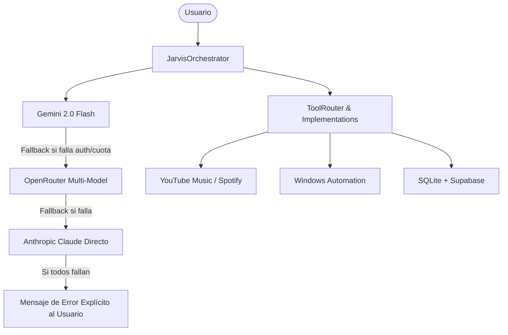

# 🤖 JARVIS v3.0 — Intelligent Desktop Assistant

JARVIS es un asistente de escritorio avanzado para Windows con capacidades de voz en tiempo real, inteligencia artificial multi-proveedor con failover automático, control y reproducción musical continua (YouTube Music & Spotify), gestión de memoria persistente y automatización del sistema operativo.

---

## 🌟 Novedades en la Versión 3.0

- **Arquitectura Multi-Provider con Failover Real:**
  - `GeminiProvider` (Google AI directo)
  - `OpenRouterProvider` (Gateway multi-modelo: GPT-4o, Claude 3.5, Llama 3.3 70B, etc.)
  - `AnthropicProvider` (Claude directo)
  - Si un proveedor no está disponible o se agota la cuota, conmuta automáticamente al siguiente sin caer silenciosamente a mocks.
- **Auto-Diagnóstico de Servicios (`/api/health`):**
  - Endpoint REST que verifica en paralelo la latencia y disponibilidad de Gemini, OpenRouter, Anthropic, YouTube Music y Spotify.
- **Control de Reproducción Bidireccional de Extremo a Extremo:**
  - Control por voz de reproducción, pausa, reanudación y salto de canciones sincronizado vía WebSockets con el reproductor de YouTube.
  - Generación inteligente de colas continuas de canciones.
- **Seguridad de Secretos:**
  - Cero credenciales en código fuente ni en logs. Enmascaramiento automático de API keys (`AIza...XyZ9`, `sk-or-...79e5`).
- **Interfaz Glassmorphic Responsiva:**
  - Orbe interactivo con estados visuales (`listening`, `processing`, `speaking`, `error`).
  - Mini-player unificado con animación de disco de vinilo y barra de progreso.
  - Diseño responsivo adaptado para ventanas desde 375px hasta monitores 4K.

---

## 🛠️ Instalación y Configuración

### 1. Clonar y preparar el entorno
```powershell
# Clonar repositorio
git clone <url-del-repositorio>
cd Jarvis

# Crear y activar entorno virtual
python -m venv venv
.\venv\Scripts\activate

# Instalar dependencias
pip install -r requirements.txt
```

### 2. Variables de Entorno (`.env`)
Copia `.env.example` a `.env` y configura tus credenciales:
```ini
# Proveedores de IA (configura al menos uno)
OPENROUTER_API_KEY=sk-or-v1-tu-clave-aqui
DEFAULT_OPENROUTER_MODEL=openai/gpt-4o

GEMINI_API_KEY=tu-clave-gemini
DEFAULT_GEMINI_MODEL=gemini-2.0-flash

# Base de datos Supabase (Opcional para sincronización en la nube)
SUPABASE_URL=https://tu-proyecto.supabase.co
SUPABASE_KEY=tu-service-role-key
```

### 3. Iniciar JARVIS
Haz doble clic en `Iniciar_Jarvis.bat` o ejecuta:
```powershell
uvicorn api.server:app --host 0.0.0.0 --port 5001
```
Abre en tu navegador: `http://localhost:5001`

---

## 🧪 Pruebas Automatizadas

```powershell
# 1. Smoke test de extremo a extremo
python scripts/smoke_test.py

# 2. Suite completa de tests unitarios e integración (92 tests)
pytest -v
```

---

## 📡 Arquitectura de Fallback



---

## 📄 Licencia
Proyecto privado desarrollado para uso personal y productividad en Windows.
