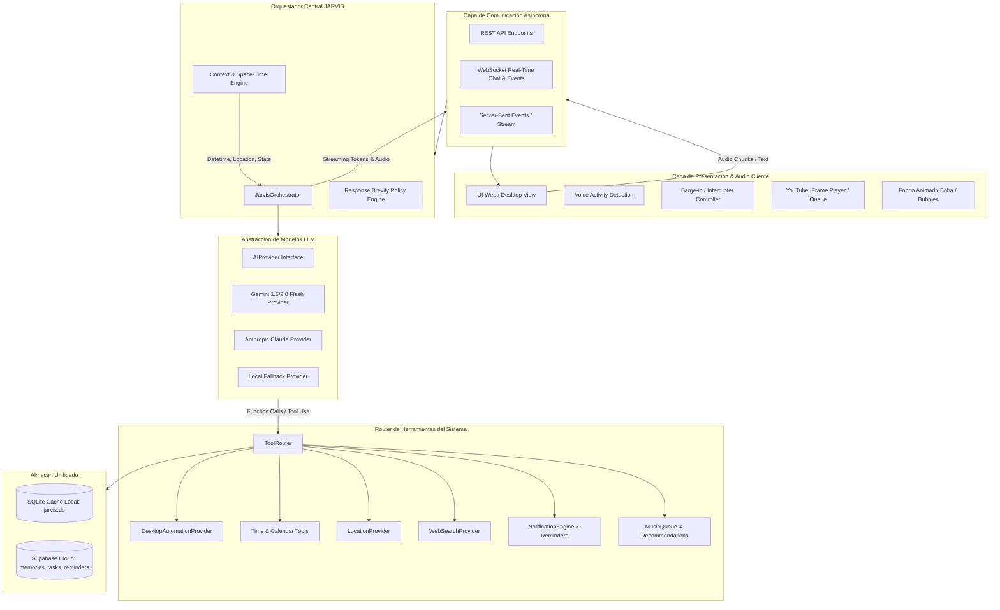

# JARVIS — ARQUITECTURA DEL SISTEMA UNIFICADO (v2.0)

> **Documento:** `/docs/ARCHITECTURE.md`  
> **Versión:** 2.0.0 — Unified Real-Time Agent Architecture  
> **Estado:** Aprobado para Fase 2  

---

## 1. VISIÓN GENERAL Y PRINCIPIOS DE DISEÑO

JARVIS es un asistente de escritorio inteligente y proactivo con procesamiento de lenguaje natural, capacidades de voz en tiempo real, ejecución segura de herramientas y memoria continua.

### Principios Fundamentales:
1. **Baja Latencia Primer Token/Audio (TTFT / TTFA < 800ms):** El sistema favorece el streaming y la asincronía sobre operaciones por lotes.
2. **Brevedad por Defecto:** Las acciones se confirman en 1 frase concisa; las explicaciones largas solo ocurren si el usuario las solicita expresamente.
3. **No Simulación de Capacidades:** Cada estado reportado en la interfaz y en las respuestas del asistente refleja el estado real de los procesos del sistema.
4. **Seguridad y Aislamiento:** Separación estricta entre acciones seguras (lecturas, aperturas estándar) y acciones peligrosas (eliminación de archivos, terminación de procesos críticos).
5. **Resiliencia y Fallback:** Funcionamiento continuo sin conexión a internet o ante fallos de APIs externas mediante caché local y proveedores alternativos.

---

## 2. DIAGRAMA DE ARQUITECTURA GENERAL

---

## 3. COMPONENTES PRINCIPALES

### 3.1. Core Orchestrator (`core/orchestrator.py`)
- Punto de entrada unificado para todas las solicitudes del usuario (voz o texto).
- Gestiona el historial de conversación en memoria de trabajo (*Short-Term Memory*).
- Ensambla el bloque de contexto dinámico (*Time, Timezone, Location, Active Tasks, User Profile*).
- Encamina la respuesta hacia el motor de streaming o hacia el `ToolRouter`.

### 3.2. Context & Space-Time Engine (`core/context_engine.py`)
- **Fecha y Hora Exacta:** Consulta en tiempo real el reloj del sistema operativo y formatea la fecha, hora, día de la semana y nombres relativos (hoy, mañana, etc.).
- **Zona Horaria:** Detecta automáticamente `tzlocal` / IANA Timezone del sistema.
- **LocationProvider:** Obtiene la ciudad/región actual mediante IP-lookup cacheado con fallback al navegador.

### 3.3. Streaming Voice Pipeline & Barge-In
- **Detección de Actividad de Voz (VAD):** En el cliente web, corta la grabación tras 700ms de silencio sin requerir clics continuos.
- **Interrupción Instantánea (*Barge-in*):** Si el usuario empieza a hablar o presiona una tecla mientras JARVIS emite voz, el cliente detiene el audio actual y envía una señal de cancelación.
- **TTS de Alta Velocidad:** Uso de TTS optimizado con streaming por frases para reproducir la primera oración en menos de 500ms.

### 3.4. NotificationEngine & Proactive Reminders (`core/notification_engine.py`)
- Hilo daemon o planificador asíncrono (*Async Scheduler*) que monitorea la base de datos cada 15 segundos.
- Genera notificaciones nativas de Windows (*Windows Toast*) y avisos sonoros cuando un recordatorio o tarea programada está próxima o cumplida.

### 3.5. DesktopAutomationProvider (`tools/implementations/desktop_tools.py`)
- Registro de aplicaciones seguras (*Safe Apps*) y control de procesos con `psutil`.
- Capacidad de:
  - Abrir aplicaciones autorizadas (`cmd`, `calc`, `notepad`, `explorer`, `spotify`, navegadores).
  - Cerrar procesos iniciados por JARVIS.
  - Listar archivos de carpetas autorizadas (`Desktop`, `Documents`, `Downloads`).
  - Buscar en Google abriendo pestañas en el navegador por defecto.

### 3.6. MusicQueue & RecommendationEngine (`tools/implementations/music_tools.py`)
- Búsqueda asíncrona paralela con `ytmusicapi` y `asyncio.gather`.
- Cola continua de reproducción: al reproducir una canción solicitada, se agregan automáticamente 5 canciones relacionadas para evitar que el reproductor se detenga al terminar la primera pista.

### 3.7. Unified Memory System (`core/memory_manager.py`)
- Base de datos relacional local SQLite (`jarvis.db`) para acceso offline ultra-rápido.
- Sincronización asíncrona no bloqueante con Supabase Cloud DB (`memories`, `user_profile`, `tasks`, `reminders`).

---

## 4. POLÍTICA DE RESPUESTAS CONCISAS

JARVIS aplica internamente las siguientes directivas de salida:
- **Acciones / Comandos:** 1 sola oración clara ("Abriendo la calculadora.", "Buscando noticias sobre IA.").
- **Confirmaciones:** 1 sola frase ("Listo, recordatorio programado a las 6:00 p.m.").
- **Consultas Breves:** Respuesta directa sin preámbulos ("Son las 4:32 p.m.").
- **Conversación Libre:** Tono humano, empático, natural y sin párrafos innecesarios salvo que el usuario pida detalles.

---

## 5. MOBILE PATH — PREPARACIÓN PARA CAPACITOR Y PWA (v4.0)

Esta arquitectura prepara a JARVIS para su empaquetado móvil sin requerir reescrituras de código frontend ni desacoplar la lógica central de Python.

### 5.1. Mapeo del Frontend PWA a Capacitor (`www/`)
- La carpeta `static/` actúa como directorio fuente de distribución (`webDir: "static"` o `www/` en `capacitor.config.json`).
- Contiene `manifest.json`, `sw.js` (Service Worker con estrategia *cache-first* para assets y *network-first* para `/api/`), e iconos adaptables (192px y 512px).
- El viewport incluye `viewport-fit=cover` y maneja variables CSS `env(safe-area-inset-*)` para integrarse con muescas (notches) y barras de navegación del sistema móvil (iOS / Android).

### 5.2. Variables de Entorno en Entornos Móviles
- **`API_BASE_URL`:** En escritorio apunta por defecto a `http://localhost:5001`. En un dispositivo móvil empaquetado o en desarrollo PWA remoto, apunta a la IP local de red o al dominio público del servidor ASGI (`https://api.tudominio.com` o túnel seguro).
- **`ALLOWED_ORIGINS`:** Configurable en `.env` / `core/config.py` para admitir `capacitor://localhost`, `ionic://localhost`, `http://localhost`, y los orígenes remotos del frontend.
- **`ENV=desktop|mobile-dev`:** Define el perfil de ejecución para habilitar o aislar dependencias de ventana nativa.

### 5.3. Aislamiento de Herramientas no Aplicables en Móvil
Ciertas herramientas de `tools/implementations/*` son exclusivas de sistemas Windows de escritorio y carecen de equivalentes directos en el WebView del móvil:
- **`windows_automation.py` (`open_application`, `close_application`, `get_active_application`):** No aplican en móvil; la capa de capacidades (`core/platform_capabilities.py`, Fase B.3) las desactiva elegantemente notificando al usuario que solo están disponibles en la app de escritorio.
- **Control de volumen con `user32`:** No disponible fuera de Windows.
- **Atajo global (`pynput Alt+Espacio`):** No aplica en Android/iOS.
- **`openWakeWord` continuo:** Exclusivo de hardware de escritorio; en móvil el input de voz se inicia mediante el botón de micrófono o Web Speech API.

### 5.4. Resiliencia de Sesión y Comunicación
- La API normaliza todas las respuestas JSON bajo el envelope `{ "ok": bool, "data": ..., "error": {...} | null }`.
- Soporte para `device_id` y `session_id` persistentes en `localStorage` y en query string/headers para conservar el contexto conversacional ante reconexiones móviles.
- Canal WebSocket `/ws/v1/chat` con reconexión por backoff exponencial y heartbeat de ping/pong cada 15 segundos para tolerar interrupciones de conectividad celular sin duplicar sesiones.

